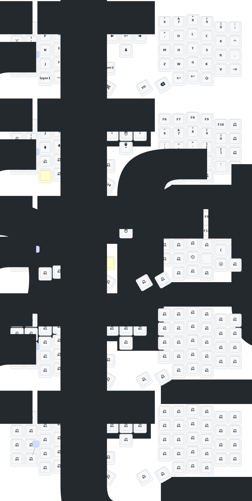

# Eyelash Sofle ZMK Firmware

ZMK firmware configuration for the **Eyelash Sofle** split ergonomic keyboard. It is set up to support two different
usage modes:

1. **Dongle Mode (Central Dongle + 2 Peripherals):** Uses a dedicated USB dongle as the central
2. **Direct Mode (Left Central + Right Peripheral):** The standard ZMK split configuration where the left half acts as
   the central device

## Keymap

